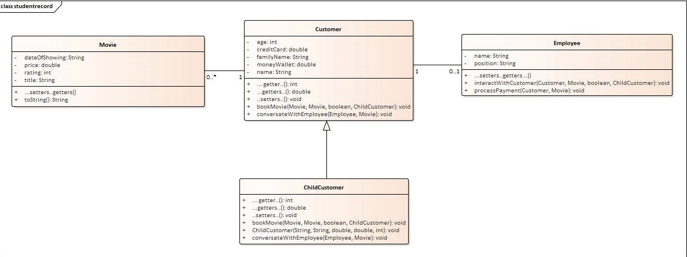

# Object-Oriented-Programming-Project1
Object Oriented Programming Project. This is a Cinema Booking System. It was one of the university projects. Utilized: Java, Eclipse IDE, OOP, UML.

# Classes’ Specification

This assignment for OOP module presents students with the opportunity to implement one of the classes given by a tutor. 

The class chosen for this assignment is Cinema Booking. 
Brief Description: A cinema booking can be for a number of adults and children. The child’s ticket price is half of the adult. The cost of the booking can be retrieved.

For this implementation there are five classes created to represent the process of booking the ticket for the movie in the cinema. 

**These are:**\
a.	Customer class\
b.	Employee class\
c.	CinemaTest class ( which represents Cinema Booking)\
d.	ChildCustomer class\
e.	Movie class

**Customer class** -  represents the specification for the customer object. A customer has certain attributes such as name, family name , age. 
He also has a certain amount of cash with him and a credit card. A customer can buy a ticket for the movie using either cash or credit card. He/she can also talk to the employee. 

**Employee class** – represents the specification for the employee object. Employee has certain attributes such as name and position. 
Employee can help the customer with booking a ticket and  can also process payments from the customer. 

**CinemaTest class** – is the class with the main method. This is the platform for all of the instances of other classes to live. 
In this class the entire process of booking the ticket to the cinema is shown. 

**ChildCustomer class** – is a child class of Customer class. This class inherits everything from the Customer class. 
The constructor of the customer class must be invoked in this class. 

**Movie class** – represents the specification for the movie object. A movie has certain attributes such as title and price. 
It also has the date of showing and the age rating 

# UML Class Diagram 

# Reflective Report

During this project I wanted to  show that I can work with multiple classes at the beginner level. 
In the assignment folder I have attached the “MyProcessOfThinkingAboutTheProject”  text file, where the name indicates is my way of starting and 
understanding  the real world object/ situation so that I can present it as an object oriented implementation. It is an essential part of this report however I am not pasting it’s content here. 
There were many errors within the code which needed to be fixed. Finding the code and finding bugs was probably the most time consuming aspect of creating this project. 
The basic idea was to create a method that connects all of the classes together and which can be invoked in the main method on the customer object. 
Method ‘bookmovie’ has a specific work flow that begins in the main method and ends in the Employee class. 
What do I mean by that? I mean that I pass specific values in the ‘bookMovie’ , which then are passed to the Customer class into ‘interactWithEmployee’  which resides in the Employee class. 
This can be presented like so:

This is what I have in mind when thinking about the ‘work flow’. I am passing values from one place to the other – from one method to another. 
As it can be seen in the code the ‘interactWithCustomer’ method is invoked on the ‘employee’ which is one of the parameters in the ‘bookMovie’.
When I pass the variable that holds a reference to the employee object in the main method the ‘employee’ variable will now hold that reference, meaning it will hold the reference to data of the employee Object. 

# THE PROBLEMS: ( At the time of writing - Nov 2021) 
As I am new to OOP in Java I didn’t have enough for everything that I wanted to do. 
For example I wanted to write a code which will allow me search through the file with the available foods that are in the cinema. 
I would like to have a conversation where the employee asks the customer about their food preference/choice and then prompt the user to enter this preference. 
This most likely would involve methods such as getChar() and getIndexOf().  
I also wanted to search through the array list  so that the user has an option to choose every movie.
In the current project the employee presents the customer with the list of the movies , however for the purpose of ‘saving some time’ for myself I only give the option of choosing the movie for the child customer. 
I also think that I should divide the code in the test class into two separate test classes so that the code is more visible and easier to read.  
Nevertheless I learned quite a lot from this assignment and all of my tests work properly. Here is the list of some of the things that I feel are important:

1.	Use shortcuts – shortcuts are extremely useful.
2.	Read what the method is doing and go to its location by clicking ctrl + right click 
3.	Write comments – this definitely helps to understand the code
4.	Talk loud to yourself as if you are teaching someone the code – this helps to understand better every step of coding. Explain the code to yourself.
5.	After you write the code auto format it so that it saves some space
6.	Don’t be afraid of difficult code – do it step by step , break it down.
7.	Ask for help
8.	Research on different websites about methods if one website is not enough. 

